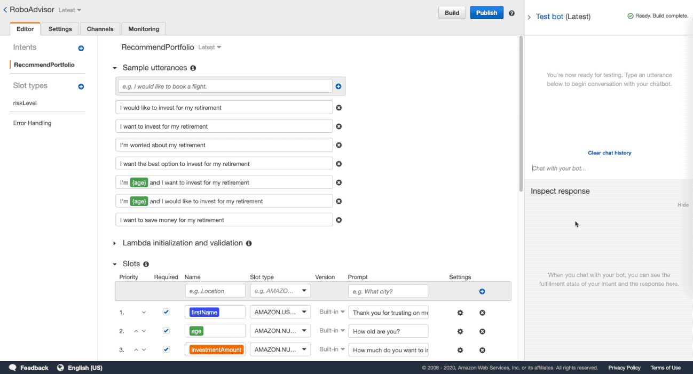
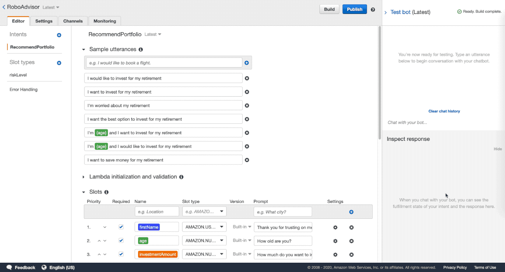
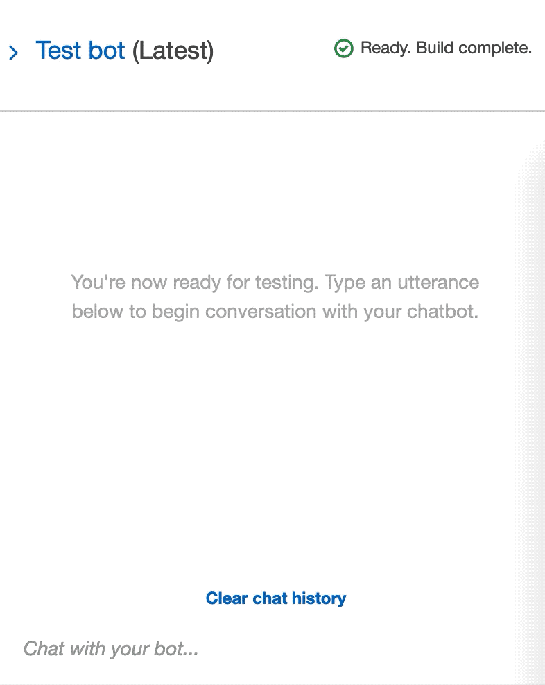
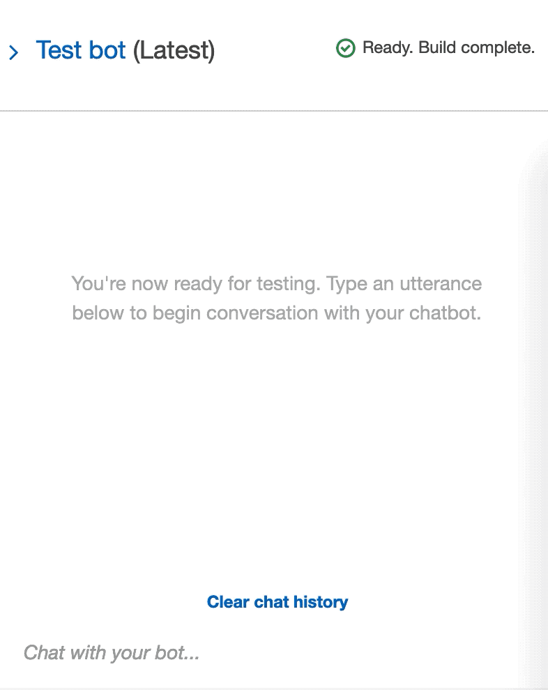

# RoboAdvisor

Using Amazon Web Services we created an Amazon Lex bot with a single intent that establishes a conversation about the requirements to suggest an investment portfolio for retirement. We were able to test the bot and have a conversation by bulding and testing, while enhancing the bot with a lambda funciton that validates the user's input and returns the investment portfolio recommendation.

## Initialization Configuration Testing . . .

Building and testing with basic prompts to have a conversation.

Testing with prompt *"I want to save money for my retirement"* : 

Testing with prompt *"I'm ​{age}​ and I want to invest for my retirement"* : 

## Implementing Lambda Function

By creating a lambda function based on the following parameters, we will validate the user provided data and reccomend an investment portfolio based on the chosen risk level.

#### User Input Validation

* The `age` should be greater than zero and less than 65.
* the `investment_amount` should be equal to or greater than 5000.

#### Investment Portfolio Recommendation

Once the intent is fulfilled, the bot should response with an investment recommendation based on the selected risk level as follows:

* **none:** "100% bonds (AGG), 0% equities (SPY)"
* **very low:** "80% bonds (AGG), 20% equities (SPY)"
* **low:** "60% bonds (AGG), 40% equities (SPY)"
* **medium:** "40% bonds (AGG), 60% equities (SPY)"
* **high:** "20% bonds (AGG), 80% equities (SPY)"
* **very high:** "0% bonds (AGG), 100% equities (SPY)"

## Testing . . .

Testing with vaild age and investment amount *(Very High Risk Level)*:

Testing with inccorect age and investment amount *(Low Risk Level)*:

Testing with inccorect age in prompt *(Medium Risk Level)*:

## Conclusion

The RoboAdvisor was a success!